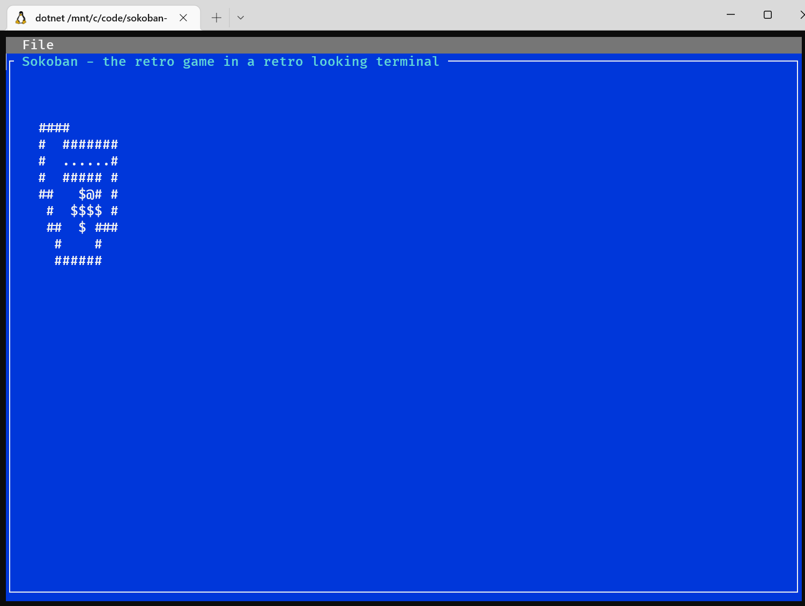

# sokoban-terminal
I want to make [sokoban](https://en.wikipedia.org/wiki/Sokoban) in the terminal.
It should be cross-platform. I wrote the game in F#, and then I have made UIs to expose the game over web with links, a Python Tkinter client, a Javascript client with UI I borrowed from https://sokoboko.glitch.me/ (https://github.com/Glorp) and a cross plattform .NET terminal UI written in C#.


To run try
```
dotnet run --project src/terminal/sokoban-terminal.csproj
```

# C# Terminal GUI

It is built with [Terminal.Gui](https://gui-cs.github.io/Terminal.Gui/index.html)




# Python things


```
dotnet new --install Fable.Template
dotnet tool restore

```

# Javascript things
Only works on my WSL setup
```
cd src/sokoban-js
npm ci
npm run start
```


# JSON 


